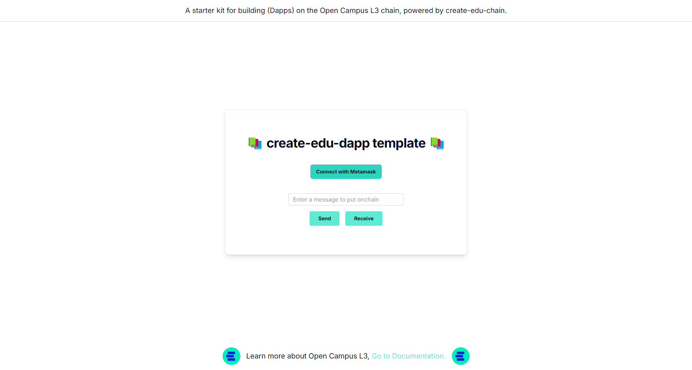

<p align="center">
    </img>
</p>

<h1 align="center">create-edu-dapp</h1>

<div align="center">
    
    
    
</div><br>

A full-stack starter template featuring Next & Hardhat, designed for building `Dapps`, as well as developing, deploying, testing, and verifying Solidity smart contracts on the Open Campus L3 chain. This starter kit includes pre-installed packages such as `create-next-app`, `hardhat full code`, `tailwindcss`, `web3.js`, and more.

## 📺 Quickstart

<div align="center">
</div>

## 🛠️ Installation guide 


### ⌛️ create-edu-dapp command

Open up your terminal (or command prompt) and type the following command:

```sh
npx create-edu-dapp <your-dapp-name>

# cd into the directory
cd <your-dapp-name>
```

### 📜 Smart Contracts

All smart contracts are located inside the Hardhat folder, which can be found in the root directory. To get started, first install the necessary dependencies by running:

```sh
# cd into the hardhat directory
cd hardhat

npm install
```

### 🔑 Private key

Ensure you create a `.env` file in the `hardhat` directory. Then paste your [Metamask private key](https://metamask.zendesk.com/hc/en-us/articles/360015289632-How-to-export-an-account-s-private-key) in `.env` with the variable name `ACCOUNT_PRIVATE_KEY` as follows:

```sh
ACCOUNT_PRIVATE_KEY=0x734...
```

### ⚙️ Compile

Now, you can write your contracts in `./contracts/` directory, replace `Greeter.sol` with `<your-contracts>.sol` file.

```sh
# For compiling the smart contracts
npx hardhat compile
```

After successful compilation, the artifacts directory will be created in `./src` with a JSON `/contracts/<your-contracts>.sol/<your-contracts>.json` containing ABI and Bytecode of your compiled smart contracts.

### 🧪 Test

To write tests, go to `./test` directory and create `<your-contracts>.js`, you can test your smart contracts using the following command.

```sh
# For testing the smart contracts
npx hardhat test
```


### ⛓️ Deploy

Before deploying the smart contracts, ensure that you have added the [`Open Campus Codex`](https://open-campus-docs.vercel.app/getting-started) to your MetaMask wallet and that it has sufficient funds. If you do not have testnet $EDU on Open Campus Codex, please follow this [faucets guide](https://open-campus-docs.vercel.app/build/faucet).

Also, make changes in `./scripts/deploy.js` (replace the greeter contract name with `<your-contract-name>`).

For deploying the smart contracts to `open campus codex` network, type the following command:

```sh
# For deloying the smart contracts
npx hardhat run scripts/deploy.js --network opencampus
```

**Copy-paste the deployed contract address [here](https://github.com/asharibali/create-edu-dapp/blob/main/app/page.js#L34).**

```sh
<your-contract> deployed to: 0x...
```

### ✅ Verify

To verify the deployed smart contract on `Open Campus Codex`, execute the following command:

```sh
# For verifying the smart contracts
npx hardhat verify --network opencampus <deployed-contract-address>
```

### 💻 Next.js client

Start the Next.js app by running the following command in the `root` directory:

```sh
npm run dev
# Starting the development server...
```



## ➡️ Contributing

We welcome contributions from the community! If you'd like to contribute, please follow the guidelines in our [CONTRIBUTING.md](https://github.com/AsharibAli/create-edu-dapp/blob/main/CONTRIBUTING.md) file.


## ⚖️ License

create-edu-dapp is licensed under the [MIT License](https://github.com/AsharibAli/create-edu-dapp/blob/main/LICENSE.md).

<hr>
Don't forget to star this repositry ⭐️ and Follow on X ~ <a href="https://twitter.com/0xAsharib" target="_blank"></a>